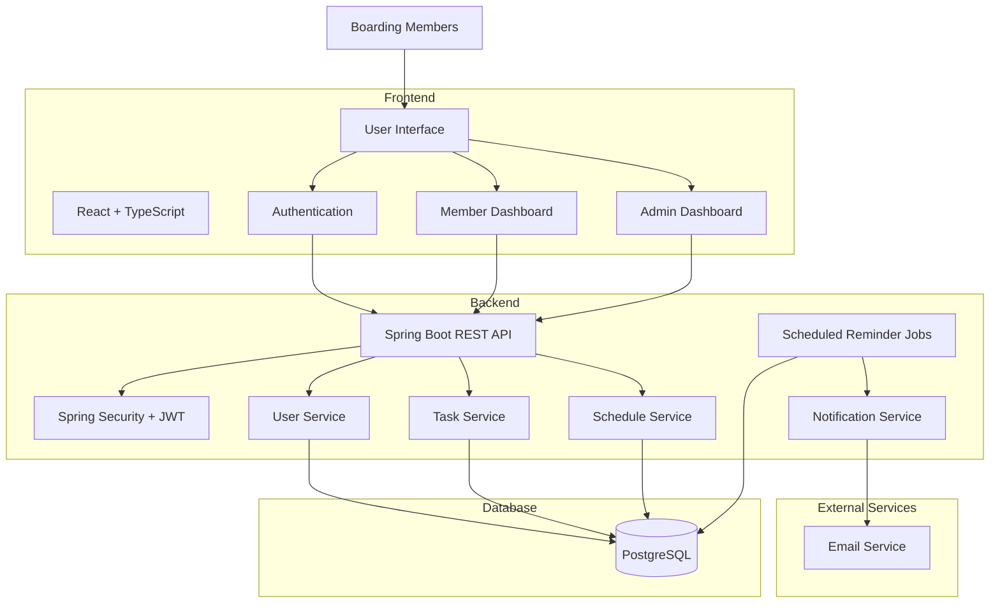

# 🏠 BoardMate

### Making shared boarding responsibilities simple.

BoardMate is a web-based boarding management system designed to organise and manage shared household responsibilities among boarding members.

The initial version focuses on managing weekly cleaning duties, task assignments, completion tracking, and automated reminders.

---

## 📌 Overview

Managing shared responsibilities in a boarding can become difficult when schedules are handled manually through messages or informal arrangements.

BoardMate provides a centralised platform where boarding members can view their responsibilities, while authorised administrators can manage weekly assignments and monitor task completion.

The system is designed around a simple weekly workflow where cleaning responsibilities are assigned every Monday.

---

## ❗ Problem Statement

The current cleaning process is managed manually, which can lead to:

* Members forgetting their assigned responsibilities.
* Difficulty identifying who is responsible for a task.
* No central record of completed tasks.
* Manual communication of reminders.
* Difficulty tracking previous cleaning schedules.
* Confusion when assignments need to be changed.
* Lack of a structured way to monitor pending tasks.

---

## 💡 Proposed Solution

BoardMate provides a centralised system for managing weekly boarding responsibilities.

The system allows:

* Boarding members to securely log in.
* Members to view their upcoming responsibilities.
* Administrators to create and manage weekly schedules.
* Administrators to assign members to cleaning tasks.
* Members to mark completed tasks.
* Administrators to verify completed tasks.
* The system to automatically send reminders before assigned duties.
* Previous schedules and task completion records to be maintained.

---

## ✨ Key Features

### 👤 Member

* Secure login
* Personal dashboard
* View upcoming cleaning duty
* View assigned task and date
* Mark task as completed
* View task history
* Receive duty reminders

### 🛡️ Administrator

* Admin dashboard
* Manage boarding members
* Create weekly schedules
* Assign members to tasks
* Modify assignments
* Verify completed tasks
* Monitor pending and completed tasks
* View cleaning history
* Manage reminder settings

### 🔔 Notification System

BoardMate supports scheduled reminders for upcoming duties.

The initial reminder schedule can include:

| Reminder   | Timing              |
| ---------- | ------------------- |
| Reminder 1 | 3 days before       |
| Reminder 2 | 1 day before        |
| Reminder 3 | On the assigned day |

---

## 🧹 Cleaning Tasks

The initial system contains three weekly responsibilities:

1. **Sweeping**
2. **Inside Washroom Cleaning**
3. **Outside Washroom Cleaning**

Each weekly schedule contains three assignments.

Example:

| Member   | Responsibility   | Date   | Status    |
| -------- | ---------------- | ------ | --------- |
| Member A | Sweeping         | Monday | Verified  |
| Member B | Inside Washroom  | Monday | Pending   |
| Member C | Outside Washroom | Monday | Completed |

---

## 🔄 Task Status

Tasks follow a controlled workflow:

```text
PENDING
   │
   ↓
COMPLETED_BY_MEMBER
   │
   ↓
VERIFIED_BY_ADMIN
```

This allows members to report completion while administrators retain the ability to verify the task.

---

## 🏗️ System Architecture



---

## 🗄️ Database Design

The application uses PostgreSQL as the primary database.

### Main Entities

```text
User
 │
 └── Assignment
        │
        ├── Task
        │
        └── Weekly Schedule
```

### Main Tables

* `users`
* `tasks`
* `weekly_schedules`
* `assignments`
* `notifications`

---

## 🛠️ Technology Stack

### Frontend

* React
* TypeScript
* Vite
* Tailwind CSS
* React Router
* Axios
* Lucide React
* React Hook Form

### Backend

* Java
* Spring Boot
* Spring Security
* Spring Data JPA
* Hibernate
* REST API

### Database

* PostgreSQL

### Authentication

* JWT
* BCrypt password hashing

### DevOps & Tools

* Git
* GitHub
* Docker
* GitHub Actions
* Postman

---

## 🎨 UI/UX

BoardMate uses a simple and clean interface designed for quick access to important information.

### Colour Direction

The primary visual identity uses:

* Warm Brown
* White
* Light Neutral Backgrounds
* Dark Text
* Green for completed tasks
* Amber for pending tasks
* Red for overdue tasks

The interface prioritises:

* Clear task status
* Simple navigation
* Mobile responsiveness
* Minimal interaction required for common actions
* Clear distinction between member and administrator functions

---

## 📁 Project Structure

```text
boardmate/
│
├── frontend/
│   ├── src/
│   │   ├── components/
│   │   ├── pages/
│   │   ├── services/
│   │   ├── hooks/
│   │   ├── context/
│   │   ├── routes/
│   │   ├── types/
│   │   ├── utils/
│   │   ├── App.tsx
│   │   └── main.tsx
│   │
│   ├── package.json
│   └── vite.config.ts
│
├── backend/
│   ├── src/
│   │   └── main/
│   │       ├── java/
│   │       │   └── com/boardmate/
│   │       │       ├── config/
│   │       │       ├── controller/
│   │       │       ├── service/
│   │       │       ├── repository/
│   │       │       ├── entity/
│   │       │       ├── dto/
│   │       │       ├── security/
│   │       │       ├── scheduler/
│   │       │       └── exception/
│   │       │
│   │       └── resources/
│   │
│   ├── pom.xml
│   └── Dockerfile
│
├── docs/
│   ├── architecture/
│   ├── database/
│   └── screenshots/
│
├── .github/
│   └── workflows/
│       └── ci.yml
│
├── docker-compose.yml
├── .gitignore
├── LICENSE
└── README.md
```

---

## 🚀 Getting Started

### Prerequisites

Make sure the following are installed:

* Node.js
* Java 17+
* Maven
* PostgreSQL
* Git

### Clone the Repository

```bash
git clone https://github.com/your-username/boardmate.git
cd boardmate
```

### Frontend

```bash
cd frontend
npm install
npm run dev
```

### Backend

```bash
cd backend
./mvnw spring-boot:run
```

---

## ⚙️ Environment Variables

Create the required environment configuration before running the application.

### Frontend

```env
VITE_API_BASE_URL=http://localhost:8080/api
```

### Backend

```env
DB_URL=jdbc:postgresql://localhost:5432/boardmate
DB_USERNAME=your_username
DB_PASSWORD=your_password

JWT_SECRET=your_secret_key

MAIL_USERNAME=your_email
MAIL_PASSWORD=your_email_password
```

> Never commit passwords, API keys, JWT secrets, or other credentials to the repository.

---

## 🔐 Security

BoardMate implements basic application security using:

* JWT-based authentication
* Role-based authorisation
* BCrypt password hashing
* Protected REST endpoints
* Input validation
* Environment-based secret management
* CORS configuration
* Secure password handling

---

## 🧪 Testing

The project includes testing for:

### Backend

* Unit tests
* Service-layer tests
* Controller tests
* Repository tests

### Frontend

* Component testing
* Form validation testing
* Authentication flow testing

### API

API endpoints can be tested using Postman.

---

## 📡 API Overview

Example endpoints:

```text
POST   /api/auth/login

GET    /api/users
GET    /api/users/{id}

GET    /api/tasks
POST   /api/tasks

GET    /api/schedules
POST   /api/schedules

GET    /api/assignments
PUT    /api/assignments/{id}/complete
PUT    /api/assignments/{id}/verify
```

---

## 🐳 Docker

The application can be run using Docker for consistent development and deployment environments.

```bash
docker compose up --build
```

---

## 📊 Future Improvements

Possible future features include:

* Automatic task rotation
* Member availability/leave requests
* Task swapping
* Overdue task detection
* Push notifications
* WhatsApp notifications
* SMS notifications
* Cleaning completion evidence
* Monthly statistics
* Member performance history
* Shared boarding expenses
* Maintenance request management
* Boarding announcements

---

## 👨‍💻 Contributors

This project is developed and maintained by the boarding members:

* Anushka
* Punsara
* Dilum
* Osanda
* Uditha
* Dilshan
* Nimesh

---

## 📄 License

This project is developed for educational and personal use.

---

## ⭐ Project Goal

BoardMate aims to make shared boarding responsibilities easier to organise, track, and complete through a simple digital platform.
