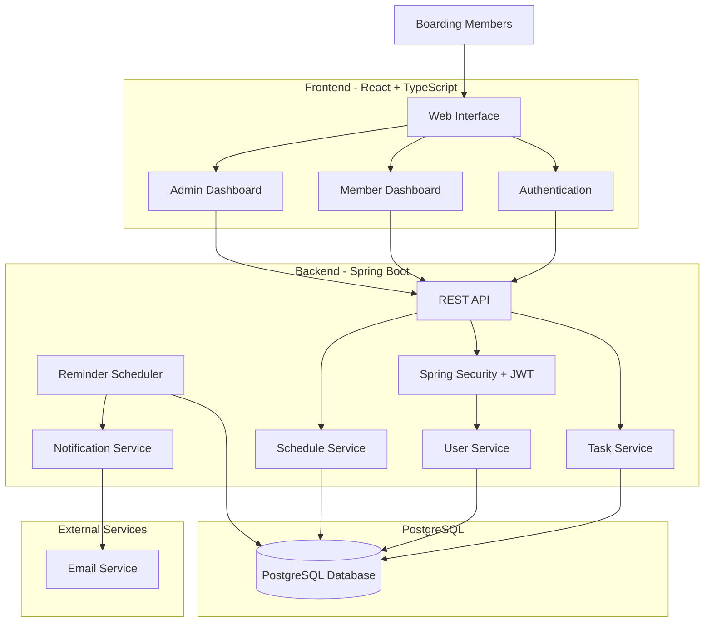

# System Architecture

The application follows a standard three-layer architecture utilizing React on the frontend, Spring Boot for the backend API, and PostgreSQL for the database.

## High Level Flow

## Tech Stack
### Frontend
- React, TypeScript, Vite, Tailwind CSS, Lucide React, React Router, Axios, React Hook Form

### Backend
- Java, Spring Boot, Spring Security, Spring Data JPA, Hibernate, REST API

### Database
- PostgreSQL

### Other
- JWT Authentication, BCrypt for password hashing
